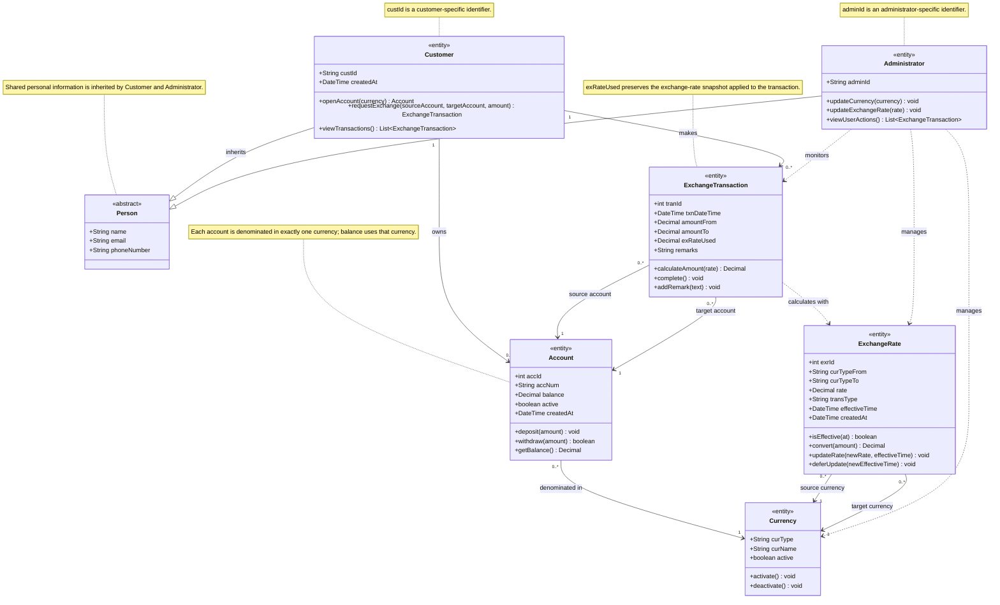

# Money Exchange System — UML Class Diagram

## Class

- **Person:** An abstract superclass that stores personal information shared by customers and administrators, including name, email address, and phone number.
- **Customer:** Represents a customer who can open accounts, request currency exchanges, and view transaction history. `custId` is the customer-specific identifier.
- **Administrator:** Represents an administrator who maintains currencies and exchange rates and monitors customer transactions. `adminId` is the administrator-specific identifier.
- **Account:** Represents a customer's currency account. It stores the account number, balance, status, creation time, and provides deposit, withdrawal, and balance-checking operations.
- **Currency:** Represents a currency supported by the system, such as NZD, USD, or CNY. It stores the currency code, currency name, and active status.
- **ExchangeTransaction:** Represents a completed or in-progress currency exchange between a source account and a target account. It records the exchanged amounts, applied exchange-rate snapshot, transaction time, and remarks.
- **ExchangeRate:** Represents the exchange rate from one currency to another. It records the rate, transaction type, effective time, and creation time and provides operations for conversion and rate updates.

## Class-relationship

- **Inheritance:** `Customer` and `Administrator` inherit the shared personal attributes from the abstract `Person` class.
- **Customer–Account association:** One `Customer` can own zero or more `Account` objects, while each `Account` belongs to exactly one customer.
- **Account–Currency association:** Each `Account` is denominated in exactly one `Currency`, while one currency can be used by zero or more accounts. The account balance is expressed in that currency.
- **Customer–ExchangeTransaction association:** One `Customer` can make zero or more `ExchangeTransaction` objects, while each transaction is associated with exactly one customer.
- **ExchangeTransaction–Account associations:** Each `ExchangeTransaction` has exactly one source account and one target account. An account can participate in zero or more transactions.
- **ExchangeTransaction–ExchangeRate dependency:** An `ExchangeTransaction` uses an `ExchangeRate` to calculate the target amount. The transaction retains `exRateUsed` as a historical snapshot.
- **ExchangeRate–Currency associations:** Each `ExchangeRate` has one source currency and one target currency. A currency can participate in multiple exchange-rate records.
- **Administrator dependencies:** An `Administrator` manages `Currency` and `ExchangeRate` objects and monitors `ExchangeTransaction` records.
